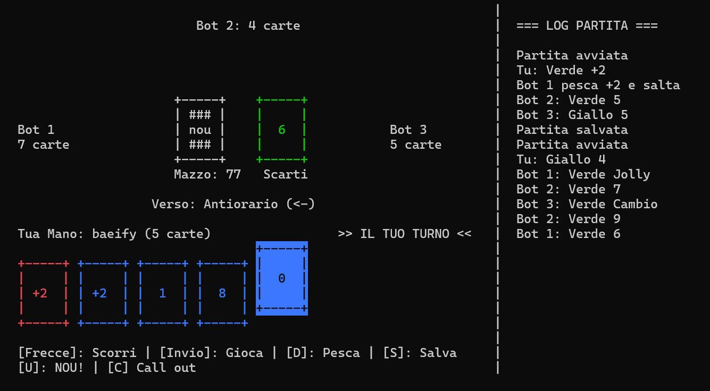

# NOU

Implementazione modulare in C del gioco di carte UNO, sviluppata con interfaccia a terminale (TUI) interattiva basata su **ncurses** e persistenza dei dati in formato JSON tramite la libreria **cJSON**.

---

## Panoramica



Il progetto replica le meccaniche del gioco da tavolo ufficiale integrando:
- Gestione completa del mazzo con rimescolamento automatico degli scarti ad esaurimento.
- Supporto alle carte azione e speciali: Salto turno, Inversione, +2, Cambio colore (Wild) e +4 (Wild Draw Four).
- IA configurabile per i bot avversari, dotata di livelli di intelligenza differenziati e logica per la selezione delle mosse.
- Meccanica di chiamata e contesa della regola "NOU!" (dichiarazione personale o penalizzazione per dimenticanza degli avversari, basato anche sull'intelligenza).
- Salvataggio e caricamento dello stato della partita e persistenza delle statistiche profilo utente.

---

## Architettura del Progetto

Il codice sorgente è organizzato secondo una struttura strettamente modulare:

* **Data Types** (`structs.h`): Definizione dei tipi enumerati (`Color`, `CardType`, `PlayerType`, `BotState`) e delle strutture dati centrali (`Card`, `Player`, `GameState`, `PlayerProfile`). 
* **Deck** (`deck.h`, `deck.c`): Inizializzazione del mazzo da 108 carte, algoritmo di shuffle (Fisher-Yates) e rimozione carte dalla pila.
* **Game Logic** (`game.h`, `game.c`): Setup del tavolo, distribuzione iniziale, validazione delle mosse legali e gestione del mazzo di pesca.
* **Turn Engine** (`turn.h`, `turn.c`): Rotazione oraria/antioraria dei turni, risoluzione degli effetti delle carte speciali e applicazione delle penalità di accumulo.
* **Bot AI** (`bot.h`, `bot.c`): Logica di decisione mossa per i bot, selezione del colore ottimale per le carte jolly e gestione probabilistica del callout.
* **Storage** (`storage.h`, `storage.c`): Serializzazione e deserializzazione JSON per lo stato di gioco (`nou_save.json`) e il profilo giocatore (`nou_profile.json`).
* **TUI** (`ui.h`, `ui.c`): Rendering a schermo intero con colori ncurses, finestre informative, menu interattivi e log eventi.
* **Entry Point** (`main.c`): Game loop, gestione degli input utente asincroni e verifica condizioni di vittoria.
---

## Compilazione ed Esecuzione

Per compilare ed eseguire **NOU**, è necessario avere un compilatore C (come GCC) e le librerie `ncurses` e `cJSON` installate nel sistema. Di seguito le istruzioni per i principali sistemi operativi.

### 1. Arch Linux

Installa i pacchetti necessari tramite `pacman`, clona la repository e compila:

```bash
# 1. Installa le dipendenze
sudo pacman -S gcc ncurses cjson git

# 2. Clona la repository
git clone https://github.com/baeify727/nou-c
cd nou-c

# 3. Compila il progetto
gcc main.c game.c deck.c turn.c bot.c storage.c ui.c -lncurses -lcjson -o nou

# 4. Esegui il gioco
./nou
```

### 2. Ubuntu / Debian / Linux Mint

I nomi dei pacchetti di sviluppo su distribuzioni basate su Debian differiscono leggermente:

```bash
# 1. Installa le dipendenze
sudo apt update
sudo apt install build-essential libncurses5-dev libncursesw5-dev libcjson-dev git

# 2. Clona la repository
git clone https://github.com/baeify727/nou-c
cd nou-c

# 3. Compila il progetto
gcc main.c game.c deck.c turn.c bot.c storage.c ui.c -lncurses -lcjson -o nou

# 4. Esegui il gioco
./nou
```

### 3. Windows 11

**NOTA: Il main menu del gioco potrebbe risultare corrotto a causa di caratteri che non sono supportati dal terminale di windows. Il gioco funziona lo stesso nonostante questo problema.**

Dato che il gioco utilizza `ncurses` (progettata per terminali Unix), il metodo più rapido e stabile per eseguire l'applicazione su Windows 11 è tramite **WSL** (Windows Subsystem for Linux).

Apri **PowerShell** come amministratore ed esegui il comando per installare WSL:
```powershell
wsl --install
```
Riavvia il computer. Poi apri nuovamente PowerShell e installa Ubuntu:
```powershell
wsl.exe --install Ubuntu
```
al termine dell'installazione, il terminale chiederà di inserire un nome utente e una password.

Una volta forniti nome utente e password, è possibile aprire Ubuntu tramite il menù Start di Windows.

Adesso bisogna spostarsi all'interno della cartella dove si è clonata la repository:
(esempio)
```bash
 cd /mnt/c/Users/[nomeutente]/Downloads/nou-c
```
nota: il percorso deve essere sempre avere /mnt/ come prefisso.

Esegui questi comandi:
```bash
# 1. Installa le dipendenze
sudo apt update
sudo apt install build-essential libncurses5-dev libncursesw5-dev libcjson-dev

# 2. Compila il progetto
gcc main.c game.c deck.c turn.c bot.c storage.c ui.c -lncurses -lcjson -o nou

# 3. Esegui il gioco
./nou
```